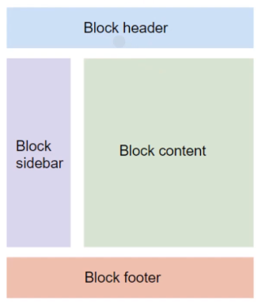

### 仮想環境をつくる
$ python3 -m venv venv

### 仮想環境を立ち上げる
$ source venv/bin/activate

### Djangoインストール
$ pip install django

### Start Project
$ django-admin startproject todoproject .

### Create App
$ python manage.py startapp todo

### todoproject/settings.py
TEMPLATES = [ 
        ... 
        'DIRS': [BASE_DIR / 'templates'], 
        ... 
]

### manage.pyと同じ階層にtemplatesディレクトリをつくる
$ mkdir templates

### todoproject/settings.pyにAppを追加
INSTALLED_APPS = [ 
    ... 
    'todo.apps.TodoConfig', 
]

### todoproject/urls.pyでurlの繋ぎ込み
from django.contrib import admin 
from django.urls import path, include 

urlpatterns = [ 
    path('admin/', admin.site.urls), 
    path('', include('todo.urls')) 
]

### todoディレクトリにurls.pyをつくる
$ touch urls.py

### todo/urls.pyにadmin追加
from django.contrib import admin 
from django.urls import path, include 

urlpatterns = [ 
    path('admin/', admin.site.urls), 
]

### サーバ立てる
$ python manage.py runserver

### Migration filesつくる
$ python manage.py makemigrations
 or 
$ python manage.py makemigrations todo

### データベースへの書き込み(migrate実行、テーブル作成)
$ python manage.py migrate

### superuserを作成
$ python manage.py createsuperuser

### CRUD機能テンプレート
Create : CreateView 
Read: ListView, DAtailView 
Update: UpdateView 
Delete: DeleteView 

### CRUD-R ListView
 : 複雑な処理 
{{}} : データ 

### CRUD-R DetailView
###### パスでPKを指定 
urlpatterns = [ 
    ... 
    path('detail/<int:pk>', TodoDetail.as_view()) 
]

### CRUD-C CreateView
##### パスを指定 
urlpatterns = [ 
    ... 
    path('create/', TodoCreate.as_view()) 
] 
##### formタグの中


### templates(htmlファイルを使い回す)

